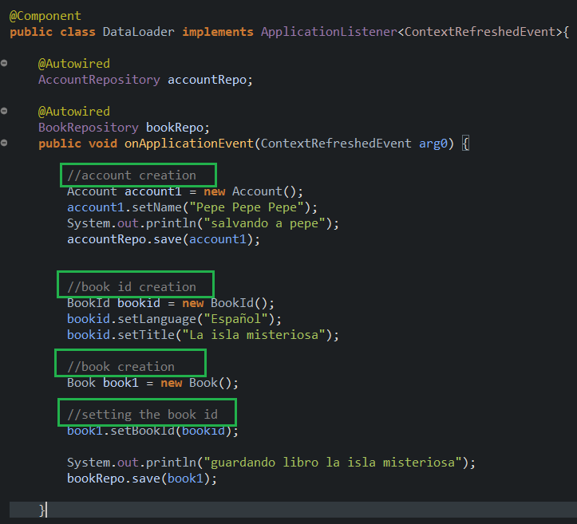

# JPAMysqlExample
Example of the JPA and Mysql Database integration

In this example,we create a composite primary key in two differents ways

<ul>
<li>using @IdClass</li>
<li>using @Embeddable</li>
</ul>

<h2>@IdClass</h2>

Defining the AccountId class and the attributes to be used as composite primary key

Defining the Account class, adding <b>@IdClass(AccountId.class)</b> and the <b>@Id</b> attributes(must be the same as AccountId)

<h2>@Embeddable</h2>

Defining the BookId class and the attributes to be used as composite primary key, the BookId class is annotated with <b>@Embeddable</b>

Defining the Book class and the bookId attribute to be used as composite primary key, the bookId attribute is annotated with <b>@EmbeddedId</b>

Defining the Load class to create account and  book instances

